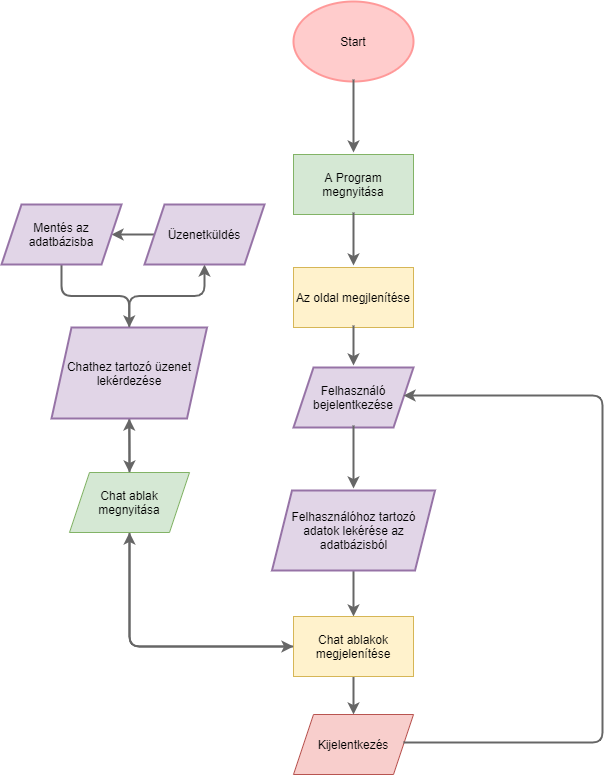

Rendszerterv
============
## A rendszer céljai és nem céljai

#### A rendszer célja
Egy belső, kisebb cég számára létrehozni egy webaplikációt, melyen keresztül a valós idejű belső kommunikáció könnyítése valósúlhat meg.

Ezzel a programmal függetlenné tudják magukat tenni más, third-party szoftverektől és nagyobb cégektől.

A saját webapplikáció lehetőséget nyújt ahhoz, hogy személyre szabott terméket kaphassanak, specializálva a cég érdekeihez és szükségeihez.

#### A rendszernek nem célja

Nem célja a webapplikációnak új szintre emelni a valós idejű üzenetváltás élményét.

Csak és kizárólag belső céges szoftver.

## Rendszer használati esetei, lefutásaik ábra

## Tervek

#### Ütemterv:
Projekt kezdete: 2020.10.08.

Követelményspecifikáció határideje: 2020.10.15.

Funkcionális specifikáció határideje: 2020.10.19.

Rendszerterv határideje: 2020.10.23.

Projekt elkészítésének határideje: 2020.11.29.

#### A projekt résztvevői:
A projekten 3 db programtervező informatikus hallgató dolgozik.

Tóth János Donát (fejlesztő)

Pataki Donát (fejlesztő)

Turi Marcell Gergő (fejlesztő)

## Wireframe

